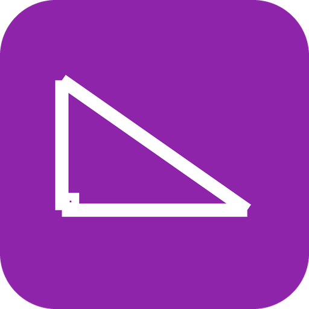

#  Geometry

Geometry knowledge for OVOS - a glossary of 24 terms and shapes
(radius, area, triangle, cylinder, ...), formulas (recited in words
and applied numerically) for rectangles, squares, triangles, circles,
and Pythagoras' theorem. Fully offline, available in English, Danish,
German, French, and Spanish.

[](https://github.com/andlo/ovos-skill-geometry/actions/workflows/test.yml)
[](https://pypi.org/project/ovos-skill-geometry/)

- [Glossary](#glossary)
- [Formulas](#formulas)
- [Usage](#usage)
- [A utility skill, not an educational one](#a-utility-skill-not-an-educational-one)
- [Known simplifications](#known-simplifications)
- [Install](#install)
- [Development](#development)

## Glossary

24 terms and shapes: `"what is a rhombus"` - a one-sentence
definition for any of 10 general terms (radius, diameter,
circumference, area, perimeter, volume, hypotenuse, vertex, angle,
diagonal), 8 2D shapes (triangle, right triangle, square, rectangle,
rhombus, pentagon, hexagon, circle), and 6 3D shapes (cube, sphere,
cylinder, cone, pyramid, rectangular prism).

## Formulas

- `"what is the formula for the area of a circle"` - recited in
  words, for the shape/property combinations that have one (area
  and/or perimeter/circumference for rectangle, square, triangle,
  circle - not every glossary shape has a formula intent, see
  DEVELOPMENT.md).
- `"what is the area of a rectangle with length 5 and width 3"` -
  applies the formula and speaks the number.
- `"what is pythagoras' theorem"` / `"what is the hypotenuse of a
  right triangle with legs 3 and 4"` - the theorem itself, and
  applying it.

## Usage
```
"what is a rhombus"
"what is the formula for the area of a circle"
"what is the area of a rectangle with length 5 and width 3"
"what is the hypotenuse of a right triangle with legs 3 and 4"
"what is pythagoras' theorem"
"hvad er en rombe"                        (Danish)
"hvad er arealet af et rektangel med længden 5 og bredden 3"  (Danish)
"was ist eine Raute"                      (German)
"was ist die fläche eines rechtecks mit der länge 5 und der breite 3"  (German)
"qu'est-ce qu'un losange"                 (French)
"quelle est l'aire d'un rectangle de longueur 5 et de largeur 3"  (French)
"qué es un rombo"                         (Spanish)
"cuál es el área de un rectángulo con largo 5 y ancho 3"  (Spanish)
```

## A utility skill, not an educational one

This provides KNOWLEDGE on demand - it doesn't quiz or teach.
[ovos-skill-geometry-practice](https://github.com/andlo/ovos-skill-geometry-practice)
depends on this package directly (imports its glossary, formulas, and
computation functions) for its quiz mode, the same relationship
`ovos-skill-geography-practice` has with `ovos-skill-geography`.

## Known simplifications

- **Scope: which shapes get formulas.** Only rectangle/square/
  triangle/circle have numeric formula intents (`area_of_rectangle`,
  etc) - rhombus/pentagon/hexagon and every 3D shape have a glossary
  DEFINITION but no formula-application intent yet. `FORMULA_PROPERTIES`
  in `__init__.py` is the exact list.
- **Numbers are parsed via `ovos-number-parser`**, handling both
  digit strings ("5") and spoken number words ("five"), per language.
  Unparseable input speaks a generic "I didn't catch that number"
  rather than guessing.
- **Irrational results are rounded to 2 decimals for speech** (`format_number()`)
  - a display choice, not a grading tolerance. This package never
  grades anything; that distinction (and why circle/non-triple-
  Pythagoras quiz questions need a REAL tolerance-band) lives in
  `ovos-skill-geometry-practice`'s DEVELOPMENT.md.
- **da-dk/de-de share one word for "perimeter" and "circumference"**
  (`omkreds`/`Umfang`) - see CREDITS.md and DEVELOPMENT.md.

## Install
```bash
pip install ovos-skill-geometry
```

## Development

See [DEVELOPMENT.md](DEVELOPMENT.md).

## Category
**Information**

## Tags
#geometry #reference #math #shapes
